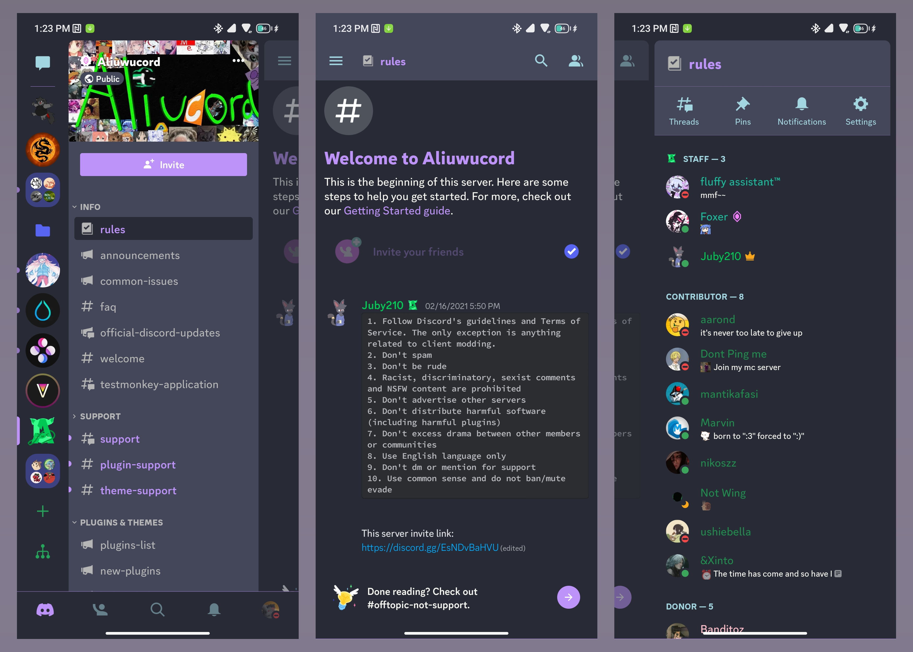
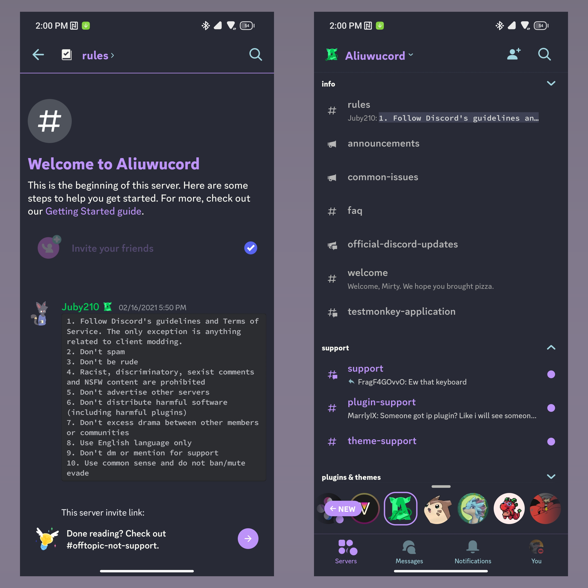

# Dracula theme for AliucordRN

This is a theme following the dracula color scheme for aliucordRN.
This theme will NOT work in aliucord kotlin (v162.21 and under).

If I missed anything or did something dumb on the theme, feel free to let me know.

## Installation

Download `Dracula.json` and move it into `AliucordRN/themes`, usually located at the root of internal storage.

## Screenshot

Some from TabsV2

